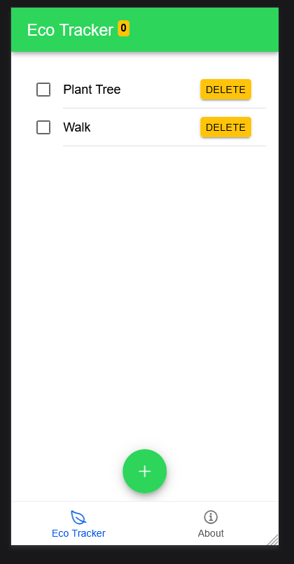
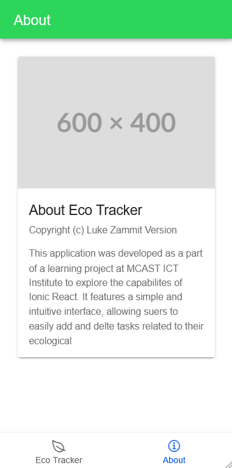
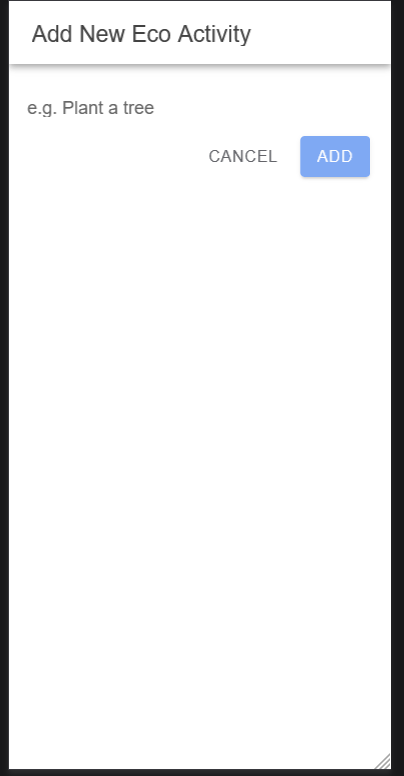
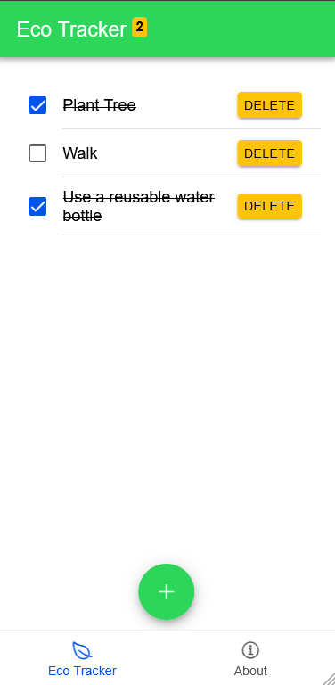
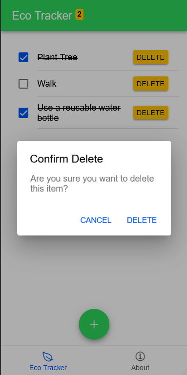
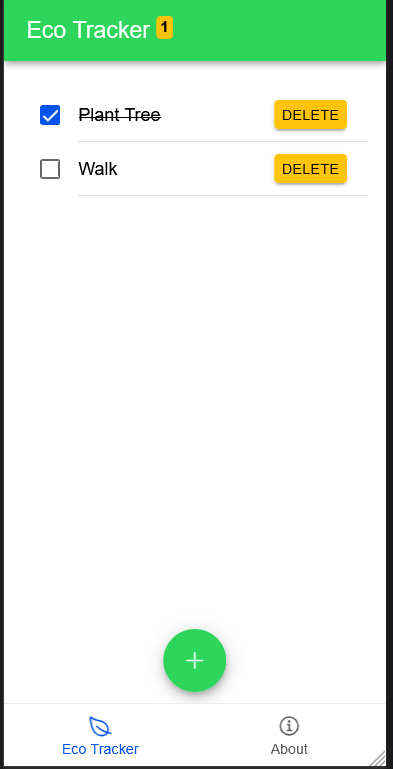

A simple to-do list Android application built as an introduction to mobile development, featuring an eco-inspired visual theme. Covers core Android concepts including UI layout, activity lifecycle, and basic data handling.

  
  
  
  
  
  

